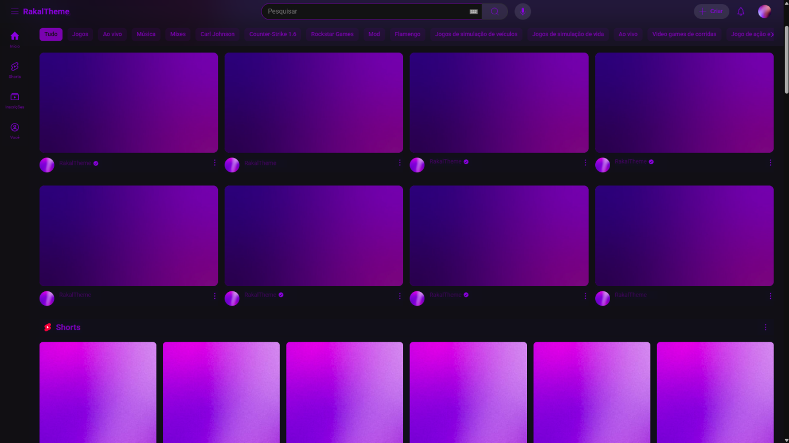

# 🎨 RakalTheme for YouTube

**RakalTheme** é um tema personalizado para o YouTube, projetado para oferecer uma aparência moderna e exclusiva à plataforma. Com uma instalação rápida e simples, você pode transformar a interface do YouTube em poucos cliques.

---

## 🚀 Instalação

Siga os passos abaixo para instalar o RakalTheme no Google Chrome:

1. Acesse a página de extensões do navegador:  
   `chrome://extensions/`

2. Ative o **Modo do desenvolvedor** (canto superior direito).

3. Clique em **"Carregar sem compactação"**.

4. Selecione a pasta baixada.

5. Pronto! Agora é só abrir o YouTube e aproveitar o novo visual automaticamente aplicado.

---

## 🔄 Atualizações

Sempre que houver uma nova versão do tema, você poderá baixá-la no link abaixo:

🔗 [Download da versão mais recente (RakalTheme.rar)](https://github.com/romay2k/rakal-theme/releases/tag/Updates)  
🗝️ **Chave de ativação**: `9XK3J-PZ7LQ-M4T8B-W2F9N`

---

## 🖼️ Preview

Copyright © 2025
